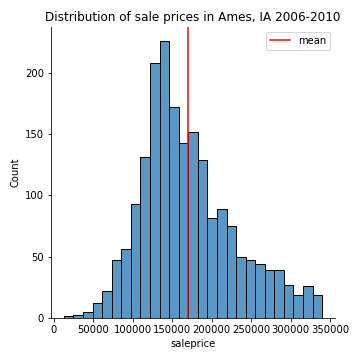
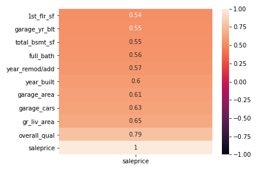
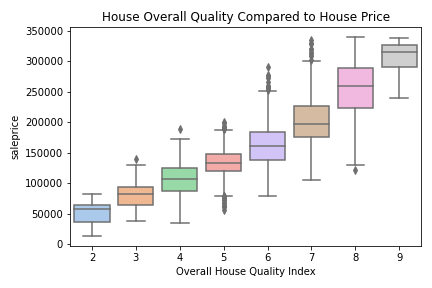
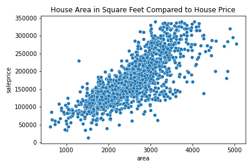
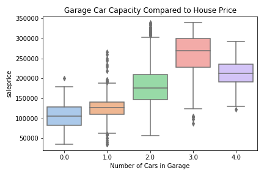
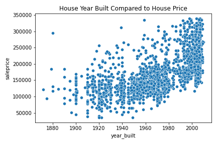
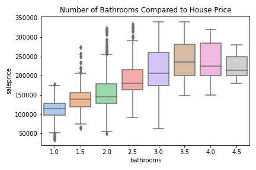
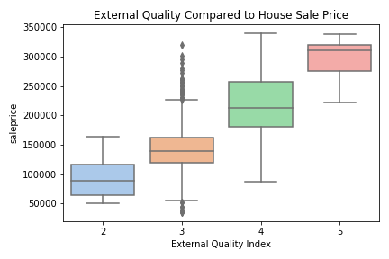
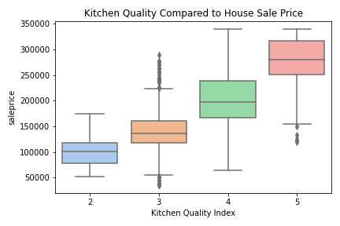

#  Project 2: Predicting House Prices

# Problem Statement

Appraisal companies determine the home values based on an in-person inspection, using recent sales of similar properties, current market trends, and aspects of the home to determine the property’s appraisal value. This project aims to create a linear regression model from the market trends of housing prices in Ames, IA from 2006 to 2010 to predict housing prices on other properties. The success of these models will be evaluated using the cross-validation scores. A model with the highest R2 scores for both trainning and testing dataset, and smallest difference in R2 scores will be selected. 

# Datasets
* [`train.csv`]('Original data/train.csv'): trainning dataset of sale price of individual residential properties sold in Ames, IA from 2006 to 2010.

* [`test.csv`]('Original data/test.csv'): testing dataset (without saleprice) of individual redisential properties sold in Ames, IA from 2006 to 2010.

# Data Dictionary

|Feature|Type|Dataset|Description|
|---|---|---|---|
|**Overall_Qual**|*Ordinal*|Train|Overall Quality of the house. 1:(Very Poor) - 10:(Very Excellent)| 
|**Area**|*Continuous*|Train|Total living area in square feet| 
|**Garage_Cars**|*Discrete*|Train|Size of garage in car capacity|
|**Year_Built**|*Discrete*|Train|Original construction date|
|**Bathrooms**|*Discrete*|Train| Total number of bathrooms in the house |
|**Kitchen_Qual_Int**|*Ordinal*|Train|Kitchen Quality, 1:(Poor) - 5:(Excellent) |
|**Exter_Qual_Int**|*Ordinal*|Train|External Quality, 1:(Poor) - 5:(Excellent) |
|**Saleprice**|*Continuousl*|Train|Sale prices in dollars|

# Data description and visualization
- Distribution plot after normalizing the sale price by dropping outliers. 
- This is also the null model, or the baseline sale price. Without any information, the best prediction of the sale price will be the mean, which is \\$170140.

- Heatmap to visualize the correlation coefficeints. 

- Box plot of the overall quality of the house vs. house pricee, with outliers removed. (1 - 10, Poor - Excellent)

- Scatter plot of the Total area of the house in square feet vs. house price.

- Box plot of the garage car capacity for the house vs. house price, outliers removed.

- Scatter plot of the year the house is built vs. house price.

- Box plot of the total number of bathrooms in the house vs. house price, outliers removed.

- Box plot of the external quality index vs. house price, outliers removed.

- Box plot of the kitchen quality of the house vs. house price, outliers removed.

# Conclusions and Recommendations
- After data cleaning, Data Analysis, and modeling with standard scaler, two models were created: Linear Regression model, Linear regression model with polynomial features. These models then undergo a regularization process using Lasso and Ridge, and the model fit to the testing dataset was evaluated using the R2 values. 
- The model that I will be utilizing for price predictions is the linear regression model with lasso regularization. It has a score of 0.842 on train data and a score of 0.830 on the test data. The difference between the two scores is 0.01, indicating a balance between the bias-variance tradeoff. 

### Train and Test scores of different models: ###

|Model|Train score|Test score|
|---|---|---|
|**Linear Regression**|Train score| 0.8420 |
|**Linear Regression**|Test score| 0.8302 |
|**Polynomial Linear Regression**|Train score|0.8690|
|**Polynomial Linear Regression**|Test score|0.8353 |
|**Ridge**| Train score| 0.8420 |
|**Ridge**| Test score |0.8301|
|**Ridge Polynomial**| Train score| 0.8769 |
|**Ridge Polynomial**| Test score |0.8567|
|**Lasso**| Train score| 0.8420 |
|**Lasso**| Test score |0.8302 |
|**Lasso Polynomial**| Train score| 0.8765 |
|**Lasso Polynomial**| Test score |0.8564 |

### Linear Regression Coefficient: ###
* Holding all else constant, for every 1 increment increase in the feature, we expect a \\$coefficient increase in the sale price. 

|Feature|Coefficient|
|---|---|
|**Total home area**|22432|
|**Year built**| 4402|
|**Bathrooms**|6735|
|**Garage Car capacity**|7047|
|**External Quality**|5395|
|**Kitchen Quality**|7154|
|**Overall Quality**|15068|

# Next Step
- The model can be further improved with more data. Homebuyers consider many other features: school districts, nearby shopping centers, commute time to the highway, and Hoa fees per month. The dataset from Ammes didn't address these. 
- More recent housing prices data can be collected to create models that are more relevant to today's housing market. 
- Economy highly affects house prices. Today's soar in the real estate market is due to inflation, which the Ames dataset will not address.
